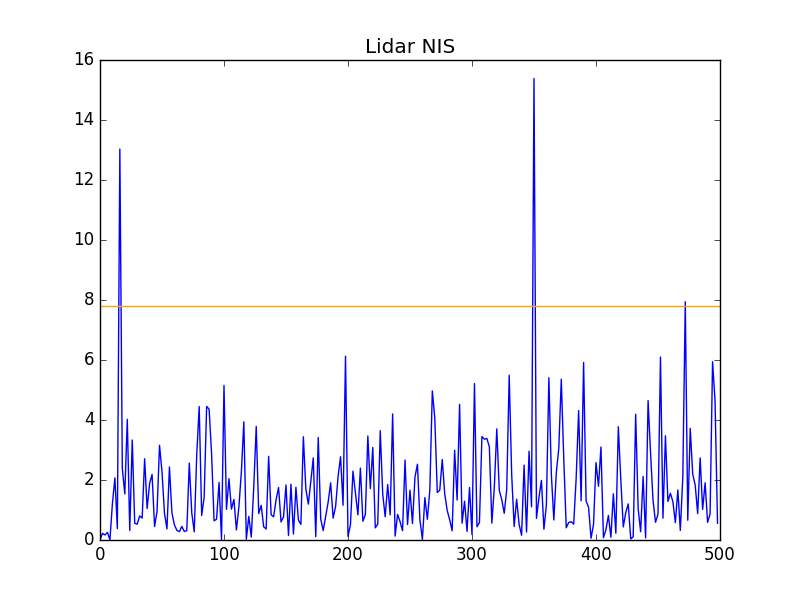
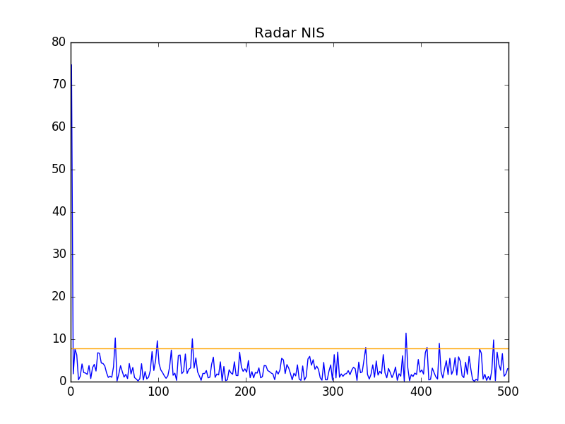

# Unscented Kalman Filter Project
Implementation of an Unscented Kalman Filter. 

In short, UKFs tackle non-linearities in process and measurement by approximating distributions through the use of sigma points.

---

## Dependencies

* cmake >= v3.5
* make >= v4.1
* gcc/g++ >= v5.4

## Basic Build Instructions

1. Clone this repo.
2. Make a build directory: `mkdir build && cd build`
3. Compile: `cmake .. && make`
4. Run it: `./UnscentedKF path/to/input.txt path/to/output.txt`. You can find

## Reported RMSE 

    0.0629184
    0.0842191
    0.333776
    0.218693

## NIS

 
 